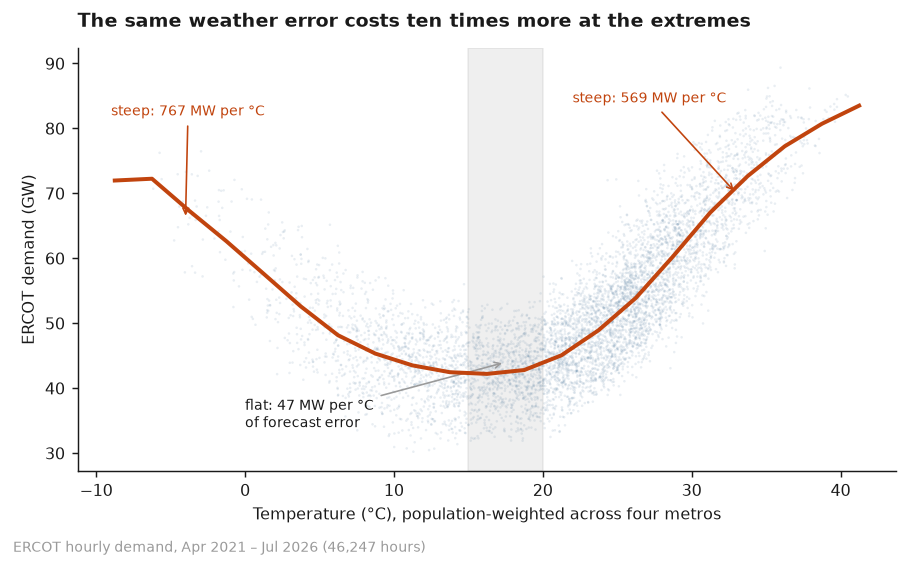
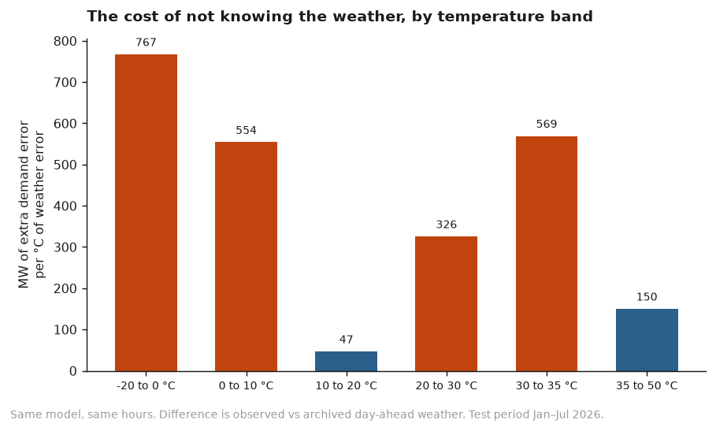
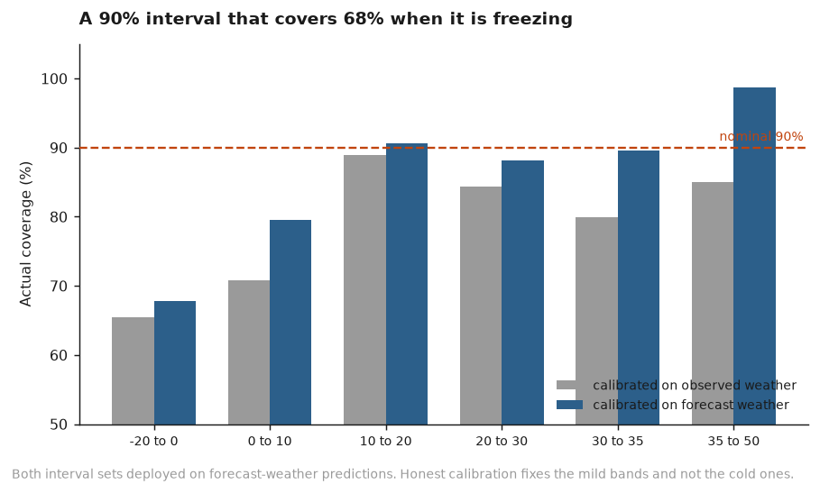
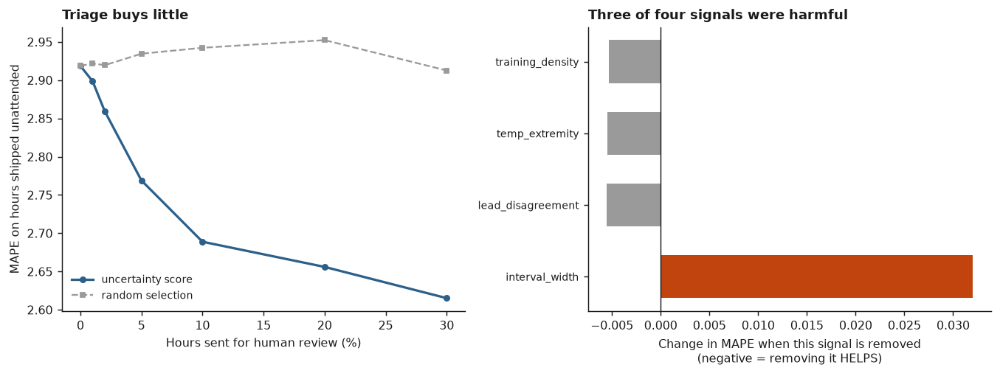

# Honest load forecasting

**Most electricity demand forecasts are backtested against the weather that
actually happened. In production you never have that.**

You have a forecast that's wrong by a degree or two. And because demand
responds non-linearly to temperature, a small weather miss becomes a large
demand miss precisely on the extreme days that matter most. So the published
accuracy number is measured on information the model will never have, and it
is optimistic exactly where you needed it not to be.

This project measures the size of that gap on ERCOT, then asks whether an
uncertainty layer can recover what's lost.

---

## Headline results

| | |
|---|---|
| **Cost of the conventional evaluation** | **+19.4% MAPE** (2.47% → 2.95%) |
| Sensitivity in the comfort zone | 47 MW per °C of weather error |
| Sensitivity below freezing | **767 MW per °C** — 16× higher |
| Prediction intervals calibrated the usual way | claim 90%, deliver **83.8%** |
| The same intervals below freezing | claim 90%, deliver **68%** |
| Selective review of the worst 5% of hours | 2.92% → 2.77% MAPE |
| Signals in the uncertainty score that helped | **1 of 4** |

Three of those are negative results. They are the most useful part.

---

## 1. The mechanism



ERCOT demand is flat between about 15 and 20 °C and steep at both ends — air
conditioning above, electric heating below. The arms are asymmetric because
cooling is entirely electric while much Texas heating is gas.

Mean day-ahead weather error is 1.19 °C, maximum 7.58 °C. That error is
roughly constant across the temperature range. Its *cost* is not.



Same model, same hours, same coefficients. The only difference is whether it
was fed observed or archived day-ahead weather. **A degree of weather error
costs 47 MW in the comfort zone and 767 MW below freezing.**

A backtest fed observed weather has zero weather error everywhere, so it never
sees any of this.

---

## 2. Four configurations

| | Train on | Test on | MAPE | MAE |
|---|---|---|---|---|
| **A** | observed | observed | 2.47% | 1,386 MW |
| **B** | observed | forecast | **2.95%** | 1,675 MW |
| **C** | forecast | forecast | 3.24% | 1,828 MW |
| **D** | forecast target, observed history | 3.24% | 1,827 MW |
| — | *ERCOT's own day-ahead forecast* | | *1.92%* | *1,098 MW* |

**A → B is the finding: +19.4%.** The same fitted model, fed the weather it
would actually have had.

**C and D are a surprise.** Training on forecast weather to match serving
conditions made things *worse*, not better — via **regression dilution**: a
predictor measured with noise gets a coefficient biased toward zero, so the
model learns a damped temperature response and under-reacts at the extremes.
Model B, trained on clean temperatures, learned the true steep response and
merely had noisy inputs at test time. That beat both alternatives.

D was built specifically to test whether using genuinely-known history helps
(only three of 43 features are actually known at T−24 — note that `t_lag1`
covers an hour still 23 hours in the *future* from the decision point). It
made no difference. The training data, not the serving split, is what matters.

*I predicted C and D would win. Both times I was wrong, and the experiment
said so.*

---

## 3. Overstated confidence



Split conformal prediction: fit on the earlier 75% of training data, calibrate
residual quantiles on the later 25%, per temperature band.

Calibrating on **observed**-weather residuals and deploying on forecast-weather
predictions gives **83.8% coverage from a nominal 90%**. Calibrating on
forecast-weather residuals recovers most of it — 88.1%, for about 8% more
width.

So the conventional approach overstates not just accuracy but **confidence**.
That is the more dangerous error: a too-narrow interval is exactly what talks
you out of a review.

**But honest calibration does not fix the cold.** Below 0 °C, coverage goes
from 65.5% to 67.9% — an interval claiming 90% is wrong a third of the time,
despite already being 11,534 MW wide (17% of load).

---

## 4. What triage does and does not buy



Rank hours by four decision-time uncertainty signals, route the worst to a
human, ship the rest unattended.

Reviewing the worst 5% moves MAPE from 2.92% to 2.77%. Random selection gets
2.94%. **The entire benefit of four designed signals is 0.17 percentage
points** — and the single worst hour (14,164 MW) is never flagged at any
review budget up to 10%.

The ablation is worse than that:

| removed | Δ MAPE |
|---|---|
| interval width | **+0.032** (hurts) |
| lead-time disagreement | −0.006 (helps) |
| temperature extremity | −0.005 (helps) |
| training density | −0.005 (helps) |

Only interval width contributes. The other three are so correlated with it —
all are essentially functions of temperature — that averaging their ranks
*dilutes* the one signal that works.

---

## 5. Why the ceiling exists

The same wall appears at three separate stages, and it is the most important
thing in this project.

The model's worst hours are 10–14 GW out, concentrated on 26–27 January 2026.
Two feature fixes aimed at them (longer temperature memory with freeze-duration
counters; a load-level anchor) moved the error almost not at all.

The diagnostic explains why: **ERCOT's own operational forecast missed the same
hours, in the same direction, by up to 9,616 MW.** On that morning demand *fell*
while temperature held near −6 °C. Demand dropping during a freeze is not a
weather response — it is behaviour, most likely a conservation appeal or
large-load curtailment.

That is also why the triage score fails. Every signal is a function of
temperature; the dominant error source is not. **You cannot build a confidence
score for an event whose cause is not in your inputs.**

The constructive version: catching those hours needs a *different input* — a
real-time demand-response feed, or the operator's own conservation notices —
not better statistics.

---

## 6. A measurement worth keeping

Baseline load moved **11 GW in five years**. Mean demand at 25 °C:

| 2021 | 2022 | 2023 | 2024 | 2025 | 2026 |
|---|---|---|---|---|---|
| 46,491 | 47,659 | 50,428 | 52,679 | 54,825 | **57,682 MW** |

Monotonic, every year. This is large flexible load — data centres, crypto
mining, industrial. Peak demand actually *fell* in 2025, which hides the
growth entirely; controlling for temperature reveals it.

---

## Data and method

| Source | What it gives |
|---|---|
| EIA-930 | Hourly demand and ERCOT's own day-ahead forecast |
| Open-Meteo Historical (ERA5) | The weather that happened |
| Open-Meteo Previous Runs (GFS, pinned) | The weather that was *forecast*, at 1–3 day lead |

**Window:** April 2021 – July 2026, 46,247 aligned hours. Train through 2025,
test on 2026. Split by time, never shuffled.

**Model:** Tao's Vanilla Benchmark (Hong 2010) plus the recency effect
(Wang, Liu & Hong 2016), with a **piecewise-linear hinge basis** in temperature
rather than Hong's cubic — the cubic extrapolated wildly into the sparse cold
tail, over-predicting sub-zero demand by +3,700 MW. Ordinary least squares
throughout: the claim here is about evaluation, and an exotic model would let a
reader dismiss the finding as an artifact.

Recency improves on vanilla by 26.2%, consistent with the 18–21% Hong reports.

**On the archive.** Open-Meteo's documentation gives two conflicting start
dates and neither is right. Probing found coverage from **April 2021** and an
undocumented **20-day outage, 2023-12-30 to 2024-01-18**, excluded by name.
Sampling found that outage by luck — it straddled the 15th of a month — so the
alignment stage audits every hour rather than spot-checking.

---

## Limitations

- Weather sampled at four metros with fixed population weights. ERCOT publishes
  load by eight weather zones; a zonal model would be more accurate.
- The 24-hour horizon is an approximation — ERCOT's day-ahead market closes
  late morning for the whole next day, so real lead times run 14–38 hours.
- `t_mean72` and `t_mean168` are shifted by 1 hour rather than the full horizon,
  so ~33% and ~14% of those windows technically postdate the decision point.
  Stated rather than hidden; the clean fix is a rebuild.
- One region, seven months of test data. Replication on a winter-peaking grid
  (ISO-NE) is the obvious next step and is not done.
- Sub-zero hours are 0.9% of training data, concentrated in two storms. Uri
  (Feb 2021) predates the forecast archive.

---

## Running it

```bash
pip install -r requirements.txt
cp .env.example .env          # free key from eia.gov/opendata
pytest                        # 147 tests, all offline

py scripts/run_s3.py          # build the aligned table
py scripts/run_s6.py          # the dual evaluation
py scripts/run_s7.py          # prediction intervals
py scripts/run_s8.py          # triage and ablation
py scripts/make_figures.py    # regenerate figures
```

Tests need no network and no API key. They cover the leakage guard (load lags
shorter than the horizon are refused), the symmetry of the two temperature
builds, the conformal coverage guarantee, and a control experiment asserting
that a *perfect* weather forecast makes all four configurations identical — so
any difference measured here comes from the weather data, not from this code.

**[→ Read the visual essay]((https://htmlpreview.github.io/?https://github.com/Lolale3/honest-load-forecast/blob/main/docs/index.html))**
